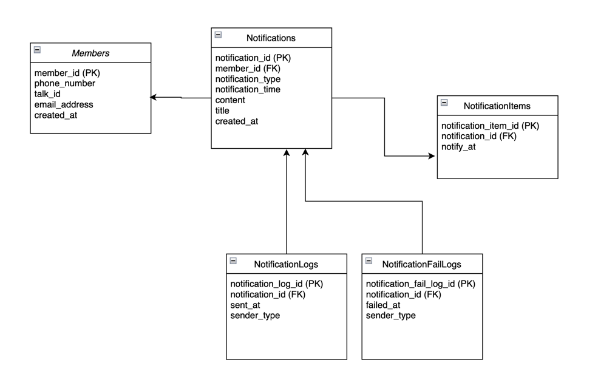

## API SPEC
### 알림발송등록 API 
#### POST /notifications
* request body 
  * 즉시 발송 
    ```json5
    {
        "memberId": 1004,
        "type": "immediate",
        "title":"test",
        "content": "알림"
    }
    ```
  * 예약 발송
    ```json5
    {
        "memberId": 1004,
        "type": "scheduled",
        "time" : "2024-05-20T11:00:00", //yyyy-MM-ddTHH:mm:ss 형식
        "title":"test",
        "content": "알림"
    }
    ```
    - 예약 발송일 경우, time이 null이거나 현재 시간보다 이전 인 경우는 실패.
* response
    ```json5
    {
        "header": {
            "isSuccessful": true,
            "resultCode": 0,
            "resultMessage": ""
        },
        "result": {
            "notificationId": 1757221248903485,
            "memberId": 1004,
            "type": "immediate",
            "time": null,
            "title": "test",
            "content": "알림 1222내용"
        }
    }
    ```
#### member정보를 찾을 수 없는 경우 
* Http Status Code : 404 NotFound 
* response

    ```json5
    {
        "header": {
            "isSuccessful": false,
            "resultCode": -1005,
            "resultMessage": "cannot find member Id : 22"
        },
        "result": null
    }
    ```

### 알림내역조회 API 
#### GET /notifications/logs?memberId=1004&page=0&size=20
* defaultSize : 20 
* response
    ```json5
    {
      "header": {
        "isSuccessful": true,
        "resultCode": 0,
        "resultMessage": ""
      },
      "totalCount": 3,
      "result": [
        {
          "notificationLogId": 1757221245067772,
          "notificationId": 1757221246492925,
          "memberId": 1004,
          "senderType": "SMS",
          "sentAt": "2024-05-18T21:46:10.04978"
        },
        {
          "notificationLogId": 1757221247911015,
          "notificationId": 1757221246922801,
          "memberId": 1004,
          "senderType": "KAKAO_TALK",
          "sentAt": "2024-05-18T21:46:14.323453"
        },
        {
          "notificationLogId": 1757221250867830,
          "notificationId": 1757221248903485,
          "memberId": 1004,
          "senderType": "KAKAO_TALK",
          "sentAt": "2024-05-18T21:46:17.239747"
        }
      ]
    }
    ```

## 프로젝트 설명
#### directory 구조
```
com.nfs.front/
          ├── NotificationFrontServerApplication.java
          ├── controller/
          │   └── NotificationLogController.java
          │   └── NotificationController.java  
          ├── service/
          │   └── NotificationService.java
          │   └── Service....
          ├── repository/
          │   └── NotificationRepository.java
          ├── model/
          │   └── Notification.java....
          ├── sender/
          │   └── 알림 발송 Sender 구현 (SMS,KakaoTalk,Email)
          ├── job/
          │   └── 로그 삭제 배치, 실패 알림 재 발송 배치, 예약 알림 배치 구현 
          └── config/
              └── WebClientConfig.java,ObjectMapperConfig,,,
```

#### Table 구조 


* 알림 등록 시 Notifications table에 등록
* 즉시 발송일 경우 바로 발송
* 예약 발송일 경우 NotificationItems에 item을 등록
* 1분마다 batch job을 실행시켜 현재 시간에 보내야할 알림을 발송
* 발송 성공, 실패 로그를 NotificationLogs, NotificationFailLogs 테이블에 각각 등록
* 실패의 경우, 배치 job으로 NotificationFailLogs를 조회하여 retry
* Member 정보는 data.sql에 초기데이터를 입력. Members Table에 발송정보들이 존재한다고 가정

#### 신경써서 구현한 부분
* Sender가 추가될 확장 가능성을 고려하여 구현
  * CompositeSender 내부에서 Sendable 인터페이스를 관리
  * Sendable 인터페이스를 구현한 클래스 : KakaoNotificationSender,EmailNotificationSender,SMSNotificationSender
  * NotificaionSender abstract class에 (공통 기능)발송 기능 구현
* 실패했을 경우 성공할때 까지 Retry 하도록 구현하였으며, 기존 Logs table과 분리함으로써 조회성능을 고려하여 구현

## 빌드 결과물 다운로드 링크 
[다운로드 JAR 파일](https://github.com/yeoseonn/20240520_2299-000143/releases/download/v1.0/notification-front-server-0.0.1-SNAPSHOT.jar)
